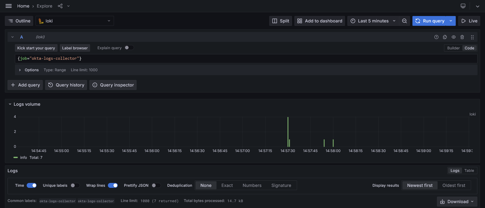

# Okta Logs Collector

This application polls Okta [System Log](https://developer.okta.com/docs/reference/api/system-log/) entries and print them to the console (`stdout`). The logs can then be forwarded to [Loki](https://grafana.com/docs/loki/latest/) using the [Promtail agent](https://grafana.com/docs/loki/latest/send-data/promtail/) or [Alloy](https://grafana.com/docs/alloy/latest/).



## Installation

You can run the application using the provided Docker image, the released binary, or by building it from source.

### Docker

The Docker image is available on [Docker Hub](https://hub.docker.com/r/grafana/okta-logs-collector). The entrypoint is set to the command itself, so you can pass the arguments directly to the container, as shown below. Alternatively, you can run the container without arguments to see the help message. Note that you can provide the API key and Okta URL as environment variables, as explained in [Configuration](#configuration).

```bash
docker run --rm --name okta-logs-collector okta-logs-collector:latest --help
```

### Binary

Download the latest release from the [releases page](https://github.com/grafana/okta-logs-collector/releases/latest). Extract the archive and run the binary.

```bash
okta-logs-collector --help
```

### Build from source

To build the application from source, you need to have Go installed on your machine. Clone the repository and run the following commands:

```bash
make build-dev
```

## Configuration

The application requires an API key to authenticate with the Okta API. The API key can be provided using the `--apiKey` flag or by setting the `API_KEY` environment variable. The Okta URL can be provided using the `--oktaURL` flag or by setting the `OKTA_URL` environment variable. The default value for the Okta URL is `https://<org>.okta.com`, which means that you need to replace `<org>` with your Okta organization name.

```bash
okta-logs-collector --apiKey <API_KEY> --oktaURL <OKTA_URL> poll
```

### Polling

The application polls the Okta API for new logs every `POLL_INTERVAL`. The default value is `10s`. The `LOOKBACK_INTERVAL` is used to rewind the time when polling for updates. The default value is `1h0m0s` (an hour).

```bash
okta-logs-collector --apiKey <API_KEY> --oktaURL <OKTA_URL> poll --pollInterval 10s --lookbackInterval 1h
```

### Logging

The application logs messages to `stdout`. The log level can be set using the `--logLevel` flag. The default value is `info`.

```bash
okta-logs-collector --apiKey <API_KEY> --oktaURL <OKTA_URL> poll --logLevel debug
```

### Timeouts

The application cancels requests after `REQUEST_TIMEOUT`. The default value is `30s`.

```bash
okta-logs-collector --apiKey <API_KEY> --oktaURL <OKTA_URL> poll --requestTimeout 30s
```

## Examples

For example usage, see the [examples](./examples/) directory. It contains configuration files for running Loki, Alloy and Promtail. The provided configuration files are for demonstration purposes only and should be adjusted to your environment. For example, you need to adjust the intervals, the Loki URL and/or remove `echo` configurations to disable printing logs to the console.

## Contributing

We welcome contributions from everyone. Just open an [issue](https://github.com/grafana/okta-logs-collector/issues) or send us a [pull request](https://github.com/grafana/okta-logs-collector/pulls).

## License

Okta logs collector is licensed under the [Apache License version 2.0](https://github.com/grafana/okta-logs-collector/blob/main/LICENSE).
